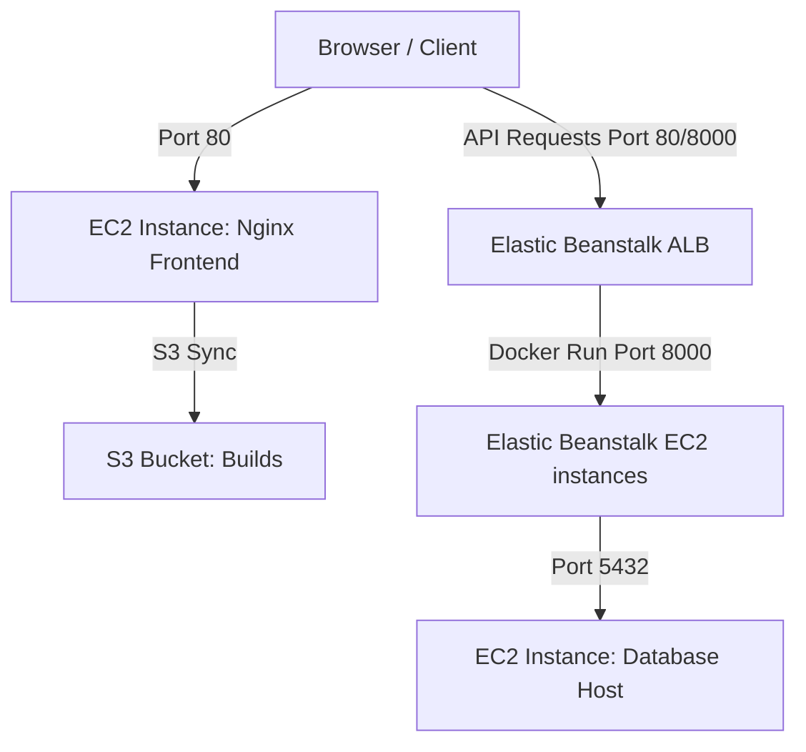

# Architecture 2: EC2 (Nginx Frontend) + Elastic Beanstalk (Backend Container) + EC2 (DB Layer)

This document provides a comprehensive technical breakdown and operational guide for **Architecture 2** of the Office Record Manager Pro application.

---

## 1. Architecture Overview

### Business Objective
The objective is to leverage a platform-as-a-service (PaaS) to auto-configure scaling, logging, and infrastructure for the backend container (using AWS Elastic Beanstalk), while serving the frontend from a standard EC2 instance running Nginx, using an S3 bucket as a central build artifact repository.

### Problem Being Solved
Managing Auto Scaling groups, Application Load Balancers, and OS patching for a containerized backend is operationally intensive. 
Architecture 2 solves this by:
*   Offloading backend infrastructure management to AWS Elastic Beanstalk.
*   Keeping the database on a dedicated EC2 host to separate data from application runtime lifecycles.
*   Deploying static web page content on a simple EC2 Nginx web host that syncs build artifacts from S3.

### Advantages
1. **Managed Scaling for Backend**: Elastic Beanstalk automatically manages load balancing, scaling, and platform updates.
2. **Centralized Builds**: Frontend static assets are built once locally, saved to S3, and pulled down onto the EC2 host.
3. **Decoupled Architecture**: None of the presentation, application, or database components share hardware.

### Disadvantages
1. **Complexity**: Managing three separate EC2/Beanstalk environments increases operational tracking overhead.
2. **Slow Deployment Sync**: Syncing static assets through S3 to EC2 has a latency delay compared to direct deployment or containerized deployments.

### Suitable Use Cases
*   Medium-scale applications with dynamic API traffic patterns where auto-scaling backend is required.
*   DevOps teams looking to minimize container configuration code (using Dockerrun.aws.json instead of ECS task definitions).

---

## 2. High-Level Architecture Diagram

---

## 3. Detailed Data Flow

1.  **Site Request**: User browses to the public IP of the Frontend EC2 instance (`Port 80`).
2.  **Asset Load**: The Nginx web server serves the React build from `/usr/share/nginx/html/`. These files were synced from S3.
3.  **API request**: The frontend JS bundle initiates a network request to the Elastic Beanstalk backend URL (e.g. `http://office-backend-env.us-east-1.elasticbeanstalk.com`).
4.  **Load Balancer Entry**: The request hits the Elastic Beanstalk ALB, which forwards it to the Beanstalk Docker container instance on port `8000`.
5.  **Query database**: The backend container queries the database using PostgreSQL Private IP `172.31.X.X` on port `5432` since they share the default VPC subnets.
6.  **Response**: Results flow back through Beanstalk ALB to the client's browser.

---

## 4. Complete AWS Services Deep Dive

### 4.1 AWS Elastic Beanstalk (Docker Platform)
*   **Internals**: Spins up Amazon Linux EC2 instances, installs Docker, and parses the `Dockerrun.aws.json` descriptor file to pull and run the application.
*   **Alternatives**: ECS, EKS.

### 4.2 Amazon S3 (Simple Storage Service)
*   **Why used**: Stores compiled frontend static builds.
*   **Internals**: Object storage service storing data as key-value pairs inside buckets.

---

## 5. Networking Deep Dive
*   The Database and Elastic Beanstalk instances reside in the **Default VPC**.
*   This allows the Beanstalk backend to connect to the database via its **Private IP** (`172.31.X.X`), keeping database traffic off the public internet.

---

## 6. Container Deep Dive
*   The backend runs inside a container managed by Elastic Beanstalk.
*   `Dockerrun.aws.json` details the container setup, including ports to expose and environment variables to pass.

---

## 7. Database Deep Dive
*   PostgreSQL 16 hosted on EC2.
*   Inbound security rules restrict port `5432` access to the Private IP range of the Elastic Beanstalk backend security group.

---

## 8. Command-by-Command Explanation

### 1. Build Frontend
*   **Command**: `npm run build -- --env VITE_API_URL=http://<YOUR_EB_ENVIRONMENT_URL>`
*   **Description**: Compiles React files into optimized static HTML/CSS/JS outputs, baking the target API URL into the code.

### 2. S3 Sync
*   **Command**: `aws s3 sync s3://office-deployments-<ACCOUNT>/arch2/frontend/ /usr/share/nginx/html/`
*   **Description**: Copies static files from the S3 bucket to the local directory on the frontend EC2 host.

---

## 9. Configuration File Deep Dive

### `Dockerrun.aws.json`
*   `AWSEBDockerrunVersion: "1"`: Specifies single-container configuration.
*   `Image`: Contains the ECR URL to download the backend container.
*   `Ports`: Binds host ports to the container.

---

## 10. Deployment Process
1.  **Step 1: DB configuration**: Keep the DB host running.
2.  **Step 2: Backend Beanstalk configuration**: Configure `Dockerrun.aws.json`, zip, upload, and deploy.
3.  **Step 3: Build frontend**: Run local build with backend endpoint target.
4.  **Step 4: S3 upload**: Upload static assets to S3.
5.  **Step 5: Frontend EC2 instance launch**: Launch Nginx EC2 host, run S3 sync script via userdata.

---

## 11. Validation and Testing
Verify static files load on the frontend EC2 IP and API queries return successfully from the Beanstalk domain.

---

## 12. Troubleshooting Handbook
*   **Problem**: Beanstalk deployment fails with ECR authorization errors.
    *   **Fix**: Ensure the Beanstalk EC2 instance profile has `AmazonEC2ContainerRegistryReadOnly` permissions.

---

## 13. Security Deep Dive
*   Minimize attack surface by making the DB Security Group accessible only from the Elastic Beanstalk security group, not `0.0.0.0/0`.

---

## 14. Monitoring and Logging
*   Elastic Beanstalk logs are available under the "Logs" tab in the EB console.
*   Nginx logs on the frontend EC2 are at `/var/log/nginx/access.log`.

---

## 15. Cost Analysis
*   **Frontend EC2**: ~$8.50/month.
*   **Beanstalk App (EC2 + ALB)**: ~$25.00/month.
*   **S3 Storage**: Less than $0.50/month.
*   **Total**: ~$42.00/month.

---

## 16. Interview Preparation Section
*   *Q: How does single container Elastic Beanstalk pull private ECR images?*
    *   *A*: The underlying EC2 instance uses its IAM instance profile. If the profile includes ECR read permissions, the Docker daemon on the host can pull the image without manual logins.

---

## 17. Beginner Learning Path
1.  Understand S3 bucket permissions and IAM roles.
2.  Learn Nginx web configuration.
3.  Study Elastic Beanstalk architectures.

---

## 18. Key Takeaways
*   Use S3 to store code artifacts.
*   Restricting DB access to private subnets improves security.
