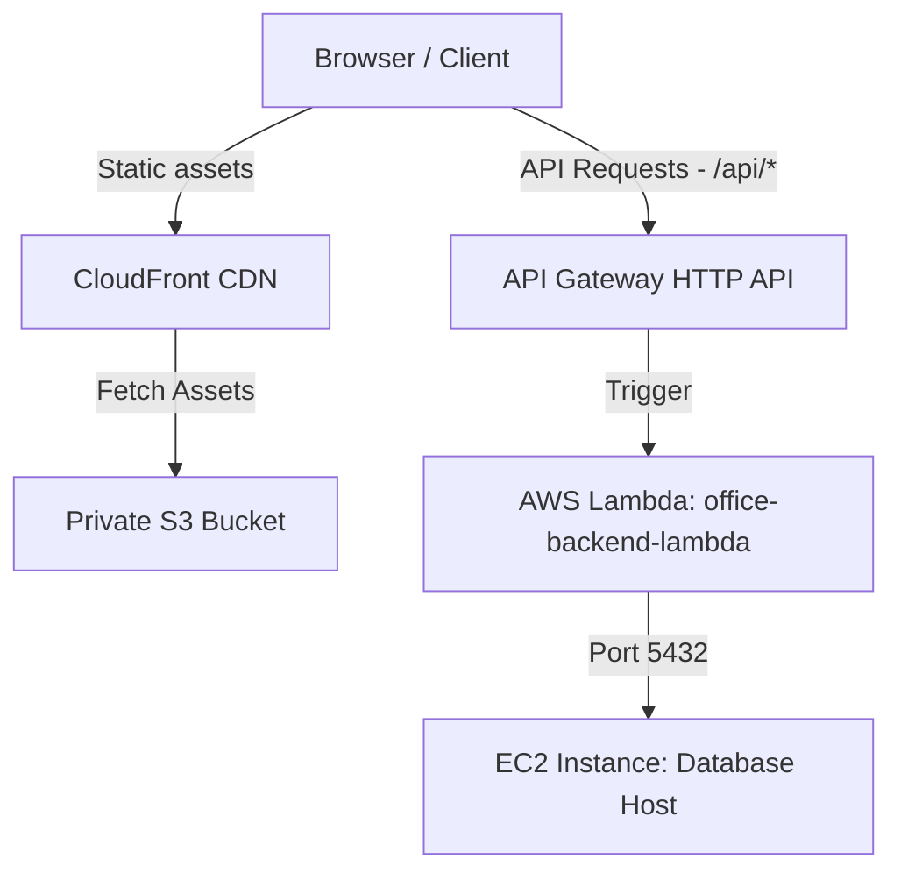

# Architecture 3: CloudFront + S3 (Frontend) + API Gateway + Lambda (Backend) + EC2 (DB Layer)

This document provides a comprehensive technical breakdown and operational guide for **Architecture 3** of the Office Record Manager Pro application.

---

## 1. Architecture Overview

### Business Objective
The objective is to establish a serverless execution environment that minimizes cost and maintenance overhead. The architecture uses static asset edge-hosting (S3 + CloudFront) and pay-per-execution API execution (AWS Lambda), backed by a persistent database host.

### Problem Being Solved
Running dedicated EC2 servers for web apps that experience idle times leads to wasted cost. 
Architecture 3 solves this by:
*   Using serverless AWS Lambda backend processing, billing only for compute time consumed.
*   Offloading static hosting to S3 and using CloudFront to cache assets closer to users.
*   Removing the need for load balancers or auto-scaling configurations.

### Advantages
1. **Low Operational Overhead**: No servers to patch or configure for the presentation or application tiers.
2. **Cost Efficiency**: No idle compute costs; Lambda is pay-per-request, and S3 static hosting is inexpensive.
3. **Global Performance**: CloudFront caches frontend assets globally at edge locations, reducing load times.

### Disadvantages
1. **Cold Starts**: Lambda functions can experience initialization latency (cold starts) when spinning up after being idle.
2. **Database Connection Limits**: Serverless architectures scale rapidly, which can overwhelm the database with too many simultaneous connections.
3. **Complex Cross-VPC Setup**: VPC integration for Lambda functions is complex and can slow down function boot times.

### Suitable Use Cases
*   Applications with highly variable or low traffic patterns.
*   Projects prioritizing low cost and minimal maintenance.
*   Static websites backed by standard REST APIs.

---

## 2. High-Level Architecture Diagram

---

## 3. Detailed Data Flow

1.  **Asset Loading**: The user requests the site via the CloudFront domain (`https://dxxxx.cloudfront.net`).
2.  **CDN Delivery**: CloudFront retrieves files from the private S3 bucket (using Origin Access Control), caches them at edge locations, and returns them to the browser.
3.  **API Request**: The browser makes an API call to `https://dxxxx.cloudfront.net/api/auth/login`.
4.  **Path Routing**: CloudFront routes the `/api/*` path to the API Gateway origin.
5.  **Lambda Trigger**: API Gateway triggers the AWS Lambda function, passing the HTTP payload.
6.  **Mangum Adapter**: Mangum maps the API Gateway payload to FastAPI routes.
7.  **Database Connection**: Lambda queries the EC2 database using its public IP address (`Port 5432`).
8.  **Response Return**: The DB response returns to Lambda, which formats the output and sends it back to the client via API Gateway and CloudFront.

---

## 4. Complete AWS Services Deep Dive

### 4.1 AWS Lambda
*   **What is it**: Serverless event-driven compute service.
*   **Why used**: Runs the backend code without provisioning or managing servers.
*   **Internal Mechanics**: Launches microVMs (Firecracker container processes) on demand to process incoming events.
*   **Alternatives**: AWS Fargate, AWS App Runner.
*   **Scaling**: Scales horizontally by launching new instances of the function in response to request volume.

### 4.2 Amazon CloudFront
*   **What is it**: Fast content delivery network (CDN) service.
*   **Why used**: Caches static assets globally and routes API requests to API Gateway under a single domain name.
*   **OAC (Origin Access Control)**: Secures the S3 origin, allowing access only from the CloudFront distribution.

---

## 5. Networking Deep Dive
*   Lambda runs outside the database VPC.
*   As a result, Lambda connects to the database via its **Public IP** (`52.55.225.111`), requiring port `5432` to be open to the public internet on the database security group.

---

## 6. Container Deep Dive
*   Although Docker is not used for deployment, the code is packaged as a zip file containing the source code and its dependencies.

---

## 7. Database Deep Dive
*   PostgreSQL running on EC2.
*   Because serverless functions can scale quickly, connection pooling (such as PGPool or AWS RDS Proxy) is recommended for production environments.

---

## 8. Command-by-Command Explanation

### 1. Copy Application Code
*   **Command**: `Copy-Item -Recurse ../../../backend/app ./app`
*   **Description**: Recursively copies the backend code folder into the Lambda build folder to prepare the deployment package.

---

## 9. Configuration File Deep Dive

### `lambda_handler.py`
*   Imports the FastAPI `app` instance.
*   Wraps the application in `Mangum(app)` to translate API Gateway events into FastAPI request objects.

---

## 10. Deployment Process
1.  **Step 1: Code assembly**: Copy backend files into `lambda_package` and compress to `lambda_function.zip`.
2.  **Step 2: Create Lambda**: Create the Lambda function, upload the zip file, and configure the handler to `lambda_handler.handler`.
3.  **Step 3: API Gateway setup**: Create an HTTP API Gateway with a proxy route (`/{proxy+}`) pointing to Lambda.
4.  **Step 4: Build frontend**: Compile the frontend, targeting the API Gateway URL.
5.  **Step 5: CloudFront setup**: Create the CloudFront distribution with the S3 bucket and API Gateway as origins.

---

## 11. Validation and Testing
Test the API by curling the API Gateway endpoint and verify the frontend loads via the CloudFront domain.

---

## 12. Troubleshooting Handbook
*   **Problem**: Lambda times out during database connections.
    *   **Root Cause**: The database security group is blocking Lambda IP addresses, or Lambda is not configured with VPC access.
    *   **Fix**: Update the DB Security Group to allow traffic on port 5432.

---

## 13. Security Deep Dive
*   Using Origin Access Control (OAC) prevents users from accessing S3 files directly, forcing all traffic through CloudFront.

---

## 14. Monitoring and Logging
*   All Lambda executions and console logs are routed to Amazon CloudWatch Log Groups under `/aws/lambda/office-backend-lambda`.

---

## 15. Cost Analysis
*   **S3 & CloudFront**: ~$1.00/month.
*   **Lambda & API GW**: Pay-per-use (often $0.00/month under AWS Free Tier).
*   **Total**: ~$1.00/month (excluding database EC2 host cost).

---

## 16. Interview Preparation Section
*   *Q: What is Mangum, and why is it needed in a Lambda FastAPI setup?*
    *   *A*: Lambda expects event payloads in JSON format. FastAPI expects ASGI HTTP requests. Mangum acts as an adapter, translating the API Gateway event JSON into ASGI request formats that FastAPI can process.

---

## 17. Beginner Learning Path
1.  Learn AWS Lambda and serverless concepts.
2.  Understand API Gateway routing and integrations.
3.  Study CloudFront origins, behaviors, and caching policies.

---

## 18. Key Takeaways
*   Serverless architectures are highly cost-efficient for low or variable traffic workloads.
*   Enable CloudFront caching only for static files, bypassing it for dynamic API requests (`/api/*`).
