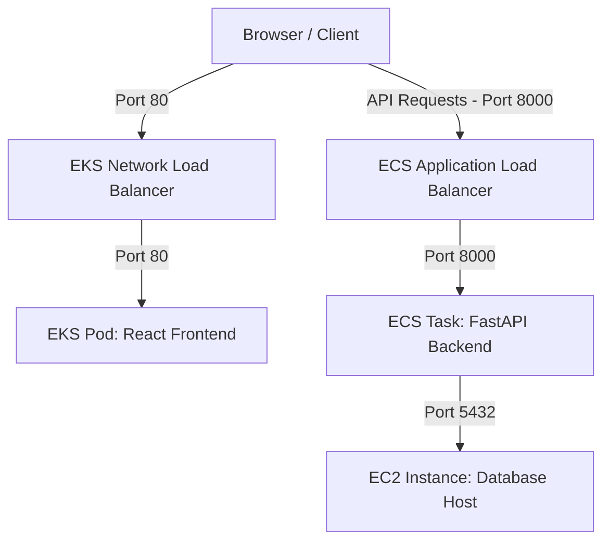

# Architecture 4: EKS (Frontend Pods) + ECS (Backend Container) + EC2 (DB Layer)

This document provides a comprehensive technical breakdown and operational guide for **Architecture 4** of the Office Record Manager Pro application.

---

## 1. Architecture Overview

### Business Objective
The objective is to split application tiers across different container orchestrators, using Amazon EKS (Elastic Kubernetes Service) to run frontend static containers and Amazon ECS (Elastic Container Service) to run the application backend, connecting to an EC2 database host.

### Problem Being Solved
Using different orchestrators for frontend and backend tiers isolates resources and allows teams with different tool preferences (Kubernetes vs. ECS) to operate independently.
Architecture 4 solves this by:
*   Running the frontend on Kubernetes pods inside EKS.
*   Running the backend on ECS Fargate task definitions.
*   Exposing the frontend via a public LoadBalancer created by the AWS Load Balancer Controller in EKS.

### Advantages
1. **Orchestrator Isolation**: The frontend and backend tiers run on separate orchestrators, reducing the blast radius of control plane failures.
2. **Standardized Declarative Configs**: The frontend deployment uses Kubernetes manifests (`frontend-k8s.yaml`).
3. **Independent Scaling**: EKS and ECS manage scaling configurations for their respective tiers independently.

### Disadvantages
2. **Operational Complexity**: Managing both EKS (Kubernetes control plane) and ECS increases the administrative learning curve.
3. **High Infrastructure Overhead**: Running both an EKS cluster and ECS services increases AWS resource usage and cost.

### Suitable Use Cases
*   Multi-team configurations where the frontend team works with Kubernetes/EKS and the backend team prefers the simplicity of Amazon ECS.
*   Migration scenarios where services are transitioned from ECS to EKS or vice-versa.

---

## 2. High-Level Architecture Diagram

---

## 3. Detailed Data Flow

1.  **Request Frontend**: The user browses to the EKS frontend load balancer DNS.
2.  **Frontend Delivery**: The LoadBalancer forwards the request on port `80` to the EKS Fargate node running the frontend Nginx pod.
3.  **Client Run**: The browser loads the static React application.
4.  **API request**: The frontend JS bundle makes an HTTP POST request to the ECS backend endpoint (e.g. `http://<ECS_BACKEND_IP>:8000`).
5.  **ECS Execution**: The ECS Fargate task processes the request.
6.  **Database query**: The backend task queries PostgreSQL running on the EC2 host via private IP on port `5432`.
7.  **Response Return**: The DB returns the records, and ECS forwards the JSON response to the client.

---

## 4. Complete AWS Services Deep Dive

### 4.1 Amazon EKS (Elastic Kubernetes Service)
*   **What is it**: Managed Kubernetes service.
*   **Why used**: Manages container orchestration for the frontend pods.
*   **Internals**: Automatically deploys and scales Kubernetes master nodes.
*   **Alternatives**: ECS, App Runner.

### 4.2 Amazon ECS (Elastic Container Service)
*   **What is it**: AWS-native container orchestration service.
*   **Why used**: Runs the backend FastAPI container using Fargate task definitions.

---

## 5. Networking Deep Dive
*   EKS and ECS run in separate subnets, typically within the same VPC.
*   The backend ECS Fargate task connects to the database via its **Private IP** (`172.31.X.X`).
*   The database security group must allow inbound connections on port `5432` from the ECS task security group.

---

## 6. Container Deep Dive
*   The frontend uses Kubernetes deployment manifests.
*   The backend uses ECS task definitions. Both pull images from ECR.

---

## 7. Database Deep Dive
*   PostgreSQL running on EC2.
*   The database is accessed securely using Private IPs, ensuring database traffic is kept off the public internet.

---

## 8. Command-by-Command Explanation

### 1. Create EKS Cluster
*   **Command**: `eksctl create cluster --name office-eks-cluster --region us-east-1 --fargate`
*   **Flags**:
    *   `--name`: Sets the cluster identifier.
    *   `--fargate`: Configures the cluster to use AWS Fargate serverless profiles for pods.

### 2. Apply Kubernetes manifest
*   **Command**: `kubectl apply -f deployments/arch4/frontend-k8s.yaml`
*   **Description**: Instructs the EKS cluster to create the frontend Deployment and LoadBalancer Service resources.

---

## 9. Configuration File Deep Dive

### `frontend-k8s.yaml`
*   `kind: Deployment`: Defines the replica count and pod template for the frontend container.
*   `kind: Service`: Exposes the pods. Using `type: LoadBalancer` instructs the AWS Load Balancer Controller to provision a public Network Load Balancer.

---

## 10. Deployment Process
1.  **Step 1: DB Configuration**: Keep the database host running on EC2.
2.  **Step 2: Deploy Backend to ECS**: Create the task definition and launch the ECS Fargate backend service.
3.  **Step 3: Compile Frontend**: Build the frontend image locally using the ECS backend URL as an argument, and push it to ECR.
4.  **Step 4: Deploy Frontend to EKS**: Connect to the cluster and apply `frontend-k8s.yaml`.

---

## 11. Validation and Testing
Check the pods status using `kubectl get pods` and test the application in the browser using the EKS load balancer DNS.

---

## 12. Troubleshooting Handbook
*   **Problem**: EKS Frontend pods remain in `Pending` state.
    *   **Root Cause**: No Fargate profile matches the namespace or labels, or VPC subnets are out of IP addresses.
    *   **Fix**: Create a Fargate profile matching the namespace (e.g. `default`).

---

## 13. Security Deep Dive
*   ECS tasks and EKS pods run under custom IAM execution roles, granting only the permissions needed to log to CloudWatch and pull from ECR.

---

## 14. Monitoring and Logging
*   EKS logs are available via `kubectl logs`.
*   ECS task logs are routed to CloudWatch under the `/ecs/` log group namespace.

---

## 15. Cost Analysis
*   **EKS Control Plane**: $73.00/month.
*   **EKS/ECS Fargate tasks**: ~$20.00/month.
*   **Total**: ~$110.00/month.

---

## 16. Interview Preparation Section
*   *Q: What is the benefit of deploying to EKS Fargate vs. managed NodeGroups?*
    *   *A*: Fargate removes the need to manage EC2 worker nodes, configure OS patches, or scale node capacities. Each pod runs in an isolated microVM.

---

## 17. Beginner Learning Path
1.  Learn Kubernetes basics (Pods, Services, Deployments).
2.  Understand `eksctl` cluster deployments.
3.  Study ECS Task Definitions and Service scaling.

---

## 18. Key Takeaways
*   Running both EKS and ECS is complex and should be reserved for migration projects or multi-team architectures.
*   Use AWS Fargate to simplify node management for both clusters.
