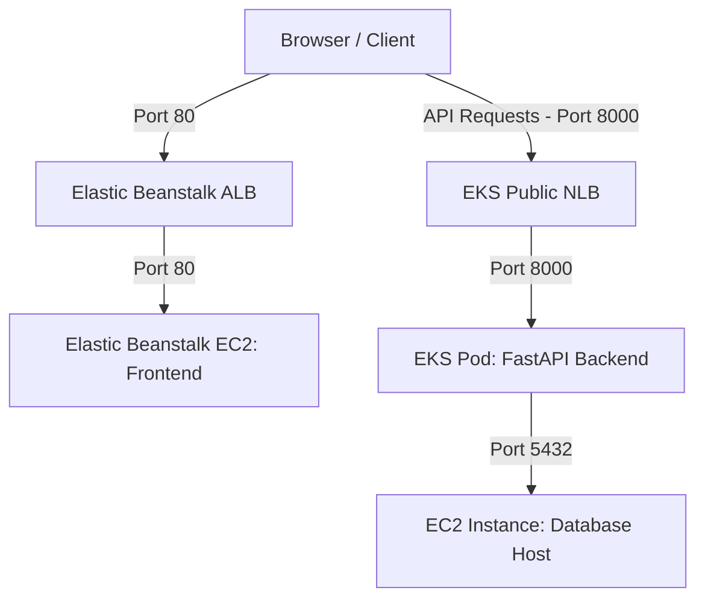

# Architecture 5: Elastic Beanstalk (Frontend) + EKS (Backend Pods) + EC2 (DB Layer)

This document provides a comprehensive technical breakdown and operational guide for **Architecture 5** of the Office Record Manager Pro application.

---

## 1. Architecture Overview

### Business Objective
The objective is to deploy the presentation layer on a managed container hosting platform (AWS Elastic Beanstalk) and the application processing layer on a highly available Kubernetes cluster (Amazon EKS), backed by a persistent database host.

### Problem Being Solved
Running production backend services requires automated health checks, self-healing, rolling updates, and granular resource limits.
Architecture 5 solves this by:
*   Running the backend container on Amazon EKS Fargate, enabling native Kubernetes scaling and health monitoring.
*   Deploying the frontend React application via Elastic Beanstalk, simplifying static edge delivery using a single container.
*   Exposing the backend via an internet-facing Network Load Balancer (NLB) to allow public access.

### Advantages
1. **Kubernetes Backend Management**: Features self-healing, resource constraints, and rolling updates for the API tier.
2. **Simplified Frontend Deployments**: Elastic Beanstalk manages scaling, logging, and infrastructure updates for the frontend.
3. **High Availability**: EKS runs backend pods across multiple Availability Zones on demand.

### Disadvantages
1. **VPC Networking Complexity**: Because the EKS cluster and Database are in separate VPCs, communication must route via public IPs.
2. **DNS Propagation Delays**: Provisioning new public Network Load Balancers in EKS can take 2 to 3 minutes for DNS records to propagate.

### Suitable Use Cases
*   Production systems where the API layer requires advanced container orchestration (EKS), while the frontend team prefers a simpler deployment pipeline (Elastic Beanstalk).
*   Scalable applications with dynamic API traffic patterns and static frontends.

---

## 2. High-Level Architecture Diagram

---

## 3. Detailed Data Flow

1.  **Request Frontend**: The user browses to the Elastic Beanstalk public domain URL.
2.  **Asset Loading**: The Beanstalk Load Balancer routes traffic to the EC2 host, which serves the frontend Nginx container.
3.  **Client Run**: The browser loads the React SPA code.
4.  **API request**: The frontend JS bundle makes an HTTP POST request to the EKS backend public NLB on port `8000` (`http://k8s-default-officeba-...elb.amazonaws.com:8000/api/auth/login`).
5.  **NLB Routing**: The NLB routes the request to a healthy backend pod running on an EKS Fargate node.
6.  **Database query**: The backend pod queries the database using its **Public IP** (`52.55.225.111:5432`) since EKS and the database run in separate VPCs.
7.  **Response Return**: The database returns the records, and the backend forwards the JSON response to the client.

---

## 4. Complete AWS Services Deep Dive

### 4.1 AWS Elastic Beanstalk
*   **What is it**: Platform-as-a-Service (PaaS) to deploy and scale applications.
*   **Why used**: Hosts the frontend React/Nginx container.
*   **Internals**: Provisions an EC2 instance running Docker, configures security groups, and sets up an ALB.

### 4.2 Amazon EKS (Elastic Kubernetes Service)
*   **What is it**: Managed Kubernetes service.
*   **Why used**: Manages container orchestration for the backend API pods.
*   **Internals**: Deploys and manages the Kubernetes control plane.

---

## 5. Networking Deep Dive
*   The EKS cluster and Database EC2 instance run in **different VPCs**.
*   Because they are in separate VPCs, communication must route using the database's **Public IP** (`52.55.225.111`).
*   The database security group must allow inbound connections on port `5432` from all sources (`0.0.0.0/0`) since EKS Fargate IPs are dynamic.
*   The EKS backend service must be configured as **internet-facing** by adding the scheme annotation:
    `service.beta.kubernetes.io/aws-load-balancer-scheme: "internet-facing"`.

---

## 6. Container Deep Dive
*   The frontend runs on Elastic Beanstalk using `Dockerrun.aws.json`.
*   The backend runs on EKS Fargate using Kubernetes deployment manifests.

---

## 7. Database Deep Dive
*   PostgreSQL running on EC2.
*   The database is accessed securely using its public IP address and credentials (`postgres` / `postgres`).

---

## 8. Command-by-Command Explanation

### 1. Apply Kubernetes Manifest
*   **Command**: `kubectl apply -f deployments/arch5/backend-k8s.yaml`
*   **Description**: Deploys the backend Deployment and LoadBalancer Service to the EKS cluster.

### 2. Zip Configuration
*   **Command**: `python -c "import zipfile; zipfile.ZipFile('deployments/arch5/office-frontend-deploy.zip', 'w', zipfile.ZIP_DEFLATED).write('deployments/arch5/Dockerrun.aws.json', 'Dockerrun.aws.json')"`
*   **Description**: Zips `Dockerrun.aws.json` into a deployment archive using Python, placing the file at the root of the archive to ensure compatibility with Elastic Beanstalk.

---

## 9. Configuration File Deep Dive

### `backend-k8s.yaml`
*   `apiVersion: apps/v1`: Specifies the schema version.
*   `service.beta.kubernetes.io/aws-load-balancer-scheme: "internet-facing"`: Configures the load balancer to be publicly accessible.

---

## 10. Deployment Process
1.  **Step 1: DB check**: Verify the database host is running and port 5432 is open.
2.  **Step 2: Deploy Backend to EKS**: Build and push the backend image, update the database connection strings in `backend-k8s.yaml`, and deploy using `kubectl`.
3.  **Step 3: Compile Frontend**: Build the frontend image locally using the new EKS backend public NLB URL as an argument, and push it to ECR.
4.  **Step 4: Package Frontend**: Zip `Dockerrun.aws.json` using Python.
5.  **Step 5: Deploy Frontend to Beanstalk**: Create the Beanstalk application and environment, upload the zip file, and deploy.

---

## 11. Validation and Testing
Check EKS backend pod health using `kubectl get pods` and test the application in the browser using the Beanstalk domain URL.

---

## 12. Troubleshooting Handbook
*   **Problem**: Connection times out when connecting to EKS backend.
    *   **Root Cause**: The LoadBalancer was provisioned with the default scheme (`internal`).
    *   **Fix**: Add the `internet-facing` annotation to the service metadata, delete the service using `kubectl delete`, and re-apply the manifest.

---

## 13. Security Deep Dive
*   FastAPI uses JWT tokens signed with `supersecretkeyofficemanagerpro12345` for secure client authentication.

---

## 14. Monitoring and Logging
*   Backend pod logs are retrieved using `kubectl logs`.
*   Beanstalk instance logs are available under the "Logs" section in the Beanstalk console.

---

## 15. Cost Analysis
*   **EKS Control Plane**: $73.00/month.
*   **EKS Fargate Pods**: ~$10.00/month.
*   **Elastic Beanstalk (EC2 + ALB)**: ~$25.00/month.
*   **Total**: ~$115.00/month.

---

## 16. Interview Preparation Section
*   *Q: Why did the backend connection time out when EKS and the database were in separate VPCs?*
    *   *A*: Resources in separate VPCs cannot communicate using private IP addresses. The connection string must be configured to use the database's public IP, and the database security group must allow inbound connections on port 5432.

---

## 17. Beginner Learning Path
1.  Learn Kubernetes manifest structures.
2.  Understand cross-VPC routing and security group rules.
3.  Study Elastic Beanstalk Docker deployment configurations.

---

## 18. Key Takeaways
*   When resources span multiple VPCs, check your VPC configurations to verify if communication requires public IPs or VPC Peering.
*   Add the `internet-facing` annotation to EKS LoadBalancer services if they need to be publicly accessible.
*   Zip deployment packages using Python's `zipfile` module to ensure compatibility with Elastic Beanstalk.
