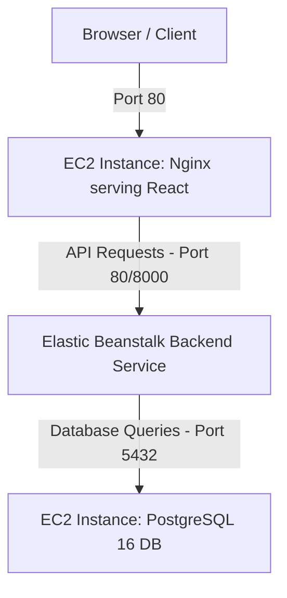

# Architecture 2: EC2 (Frontend) + Elastic Beanstalk (Backend) + EC2 (DB Layer)

This document provides step-by-step instructions to manually configure and deploy the second architecture.



---

## 🗄️ Step 1: Database Setup (EC2 Host)
*This is the same PostgreSQL database running on your EC2 instance from Architecture 1.*
*   Ensure PostgreSQL 16 is running on port `5432` and configured to listen on `*` with trust authentication.
*   Note down your **EC2 DB Private IP** (e.g., `172.31.X.X`).

---

## 🚀 Step 2: Deploy Backend to Elastic Beanstalk (AWS Console)

1.  **Configure `Dockerrun.aws.json`:**
    *   Open [Dockerrun.aws.json](file:///d:/fullstack/deployments/arch2/Dockerrun.aws.json).
    *   Update your Database IP in the environment variables:
        ```json
        { "name": "DATABASE_URL", "value": "postgresql://postgres:postgres@<YOUR_EC2_DB_PRIVATE_IP>:5432/officedb" },
        ```
    *   Also make sure your ECR repository URL matches under the `Image` block (e.g., `542119827880.dkr.ecr.us-east-1.amazonaws.com/backend-app:latest`).
2.  **Package Backend for Elastic Beanstalk:**
    *   Zip `Dockerrun.aws.json` into a compressed file named `eb-backend.zip` (it only needs to contain `Dockerrun.aws.json` for docker-platform Beanstalk environments).
3.  **Create Elastic Beanstalk Environment:**
    *   Open **Elastic Beanstalk** on the AWS Console.
    *   Click **Create application**.
    *   **Application Name:** `office-backend-app`
    *   **Platform:** Choose **Docker**.
    *   **Platform Branch:** Select **Docker running on 64bit Amazon Linux 2023** (or latest).
    *   **Application code:** Select **Upload your code** and upload your `eb-backend.zip`.
    *   Click **Create application** (this will spin up an EC2 instance behind an Auto Scaling group and run your docker container).
4.  **Configure environment properties (Alternative):**
    *   Under Beanstalk environment **Configuration** -> **Updates, monitoring, and logging** -> **Platform properties**, you can also add/modify environment properties like `GROQ_API_KEY`, `JWT_SECRET_KEY`, etc.
5.  **Record Environment URL:**
    *   Once healthy, copy the Beanstalk URL (e.g., `http://office-backend-env.eba-xxxx.us-east-1.elasticbeanstalk.com`).

---

## 💻 Step 3: Deploy Frontend to EC2 (Nginx)

1.  **Create S3 Bucket for Builds:**
    *   Go to **Amazon S3** -> **Create bucket**. Name: `office-deployments-<YOUR_ACCOUNT_ID>`.
2.  **Build and Upload Frontend:**
    *   On your local machine's terminal:
        ```bash
        cd frontend
        
        # Build pointing to your Elastic Beanstalk URL
        npm run build -- --env VITE_API_URL=http://<YOUR_EB_ENVIRONMENT_URL>
        ```
        *(Or build standard `dist` folder and use environment variable injection).*
    *   Upload the entire contents of the `dist/` directory to your S3 bucket under the folder `arch2/frontend/`.
3.  **Launch Frontend EC2 Instance:**
    *   Go to **EC2 Dashboard** -> **Launch Instance**.
    *   **AMI:** Amazon Linux 2023 (or Ubuntu).
    *   **IAM Instance Profile Role:** Attach a role that has read access to your S3 bucket (e.g., `AmazonS3ReadOnlyAccess`).
    *   **Security Group Rules:**
        *   SSH (Port 22) -> `My IP`
        *   HTTP (Port 80) -> `0.0.0.0/0`
    *   **Advanced Details -> User Data:** Paste the contents of [userdata_frontend_ec2.sh](file:///d:/fullstack/deployments/arch2/userdata_frontend_ec2.sh), making sure to update the S3 bucket path:
        ```bash
        aws s3 sync s3://office-deployments-<YOUR_ACCOUNT_ID>/arch2/frontend/ /usr/share/nginx/html/
        ```
4.  **Access Site:**
    *   Open your Frontend EC2 instance's Public IP in your browser to verify it connects to the Beanstalk backend and PostgreSQL database.
