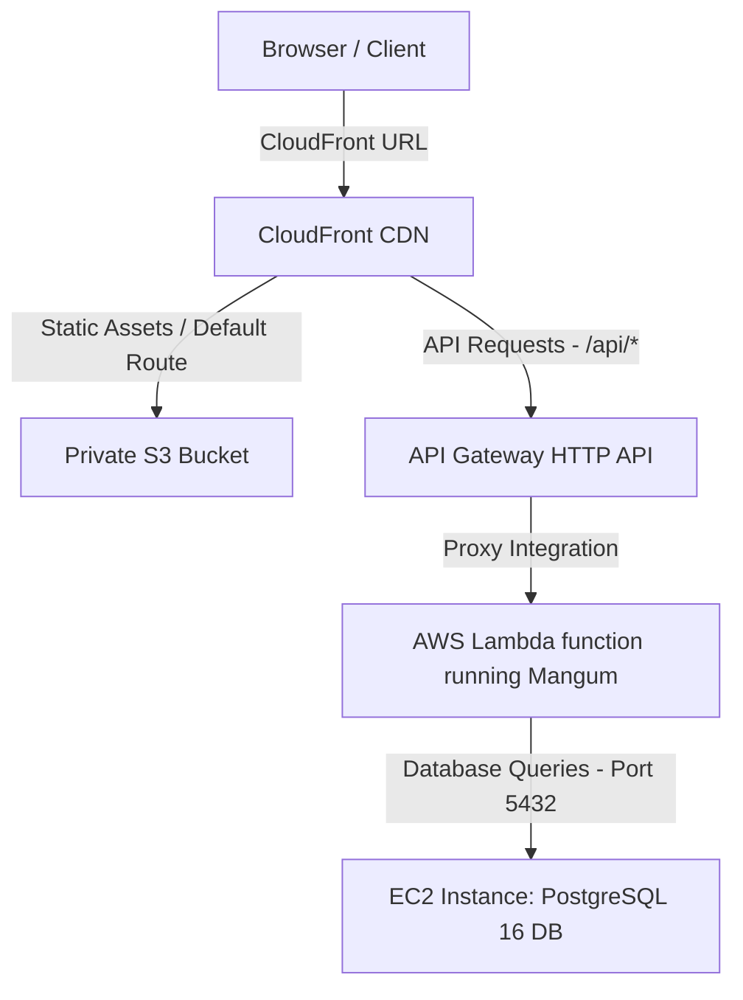

# Architecture 3: CloudFront + S3 (Frontend) + API GW (API Calls) + Lambda (Backend) + EC2 (DB Layer)

This document provides step-by-step instructions to manually configure and deploy the third architecture.



---

## 🗄️ Step 1: Database Setup (EC2 Host)
*Ensure your PostgreSQL EC2 database is running and accessible on port `5432` from AWS Lambda.*
*   Make sure you note down the **Public IP** or **Elastic IP** of your EC2 database (since Lambda runs outside the EC2 VPC unless you configure VPC integration).
*   Ensure the EC2 Security Group inbound rule allows Port `5432` from `0.0.0.0/0` (or the CIDR block of your Lambda VPC).

---

## ⚡ Step 2: Deploy Backend to AWS Lambda & API Gateway

1.  **Prepare the Lambda Deployment Package:**
    *   Navigate to the lambda package directory:
        ```bash
        cd deployments/arch3/lambda_package
        ```
    *   Copy your backend application source folder (`app/` containing models, services, routers, database configuration etc.) into this `lambda_package` directory:
        ```powershell
        Copy-Item -Recurve ../../../backend/app ./app
        ```
    *   Compress the entire contents of `lambda_package` (including `app/`, `lambda_handler.py`, `mangum/`, and helper files) into a file named `lambda_function.zip`.
2.  **Create AWS Lambda Function:**
    *   Go to the **AWS Lambda Console** -> **Create function**.
    *   Select **Author from scratch**.
    *   **Function Name:** `office-backend-lambda`
    *   **Runtime:** `Python 3.10` or `Python 3.11`.
    *   Click **Create function**.
3.  **Upload Code & Configure Handler:**
    *   Under the **Code** tab, click **Upload from** -> **.zip file** and select your `lambda_function.zip`.
    *   Scroll down to **Runtime settings** -> click **Edit**.
    *   Change the **Handler** name to `lambda_handler.handler` (representing the `handler` object inside `lambda_handler.py`).
4.  **Configure Environment Variables:**
    *   Under **Configuration** -> **Environment variables** -> **Edit**.
    *   Add:
        *   `DATABASE_URL` = `postgresql://postgres:postgres@<YOUR_EC2_DATABASE_PUBLIC_IP>:5432/officedb`
        *   `JWT_SECRET_KEY` = `supersecretkeyofficemanagerpro12345`
        *   `JWT_ALGORITHM` = `HS256`
        *   `GROQ_API_KEY` = `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`
5.  **Create API Gateway (HTTP API):**
    *   Go to **API Gateway** -> **Create API** -> Choose **HTTP API**.
    *   Name: `office-api-gw`.
    *   Click **Next**. Create a route:
        *   **Method:** `ANY`
        *   **Path:** `/{proxy+}`
        *   **Integration:** Choose **Lambda** and select `office-backend-lambda`.
    *   Click **Next** through default stages and **Create**.
    *   Copy the **Invoke URL** (e.g. `https://xxxx.execute-api.us-east-1.amazonaws.com`).

---

## 🌐 Step 3: Deploy Frontend to S3 and CloudFront

1.  **Build Frontend:**
    *   Build your frontend locally pointing to the API Gateway Invoke URL:
        ```bash
        cd frontend
        npm run build -- --env VITE_API_URL=https://xxxx.execute-api.us-east-1.amazonaws.com
        ```
2.  **Upload to S3 Bucket:**
    *   Create a private S3 bucket named `office-frontend-s3-<YOUR_ACCOUNT_ID>`.
    *   Upload all files inside `dist/` directly into this S3 bucket.
3.  **Create CloudFront Distribution:**
    *   Go to **Amazon CloudFront** -> **Create distribution**.
    *   **Origin domain:** Select your S3 bucket.
    *   **Origin Access:** Select **Origin Access Control (OAC)** -> Create control setting -> Configure S3 bucket policy to allow CloudFront access.
    *   **Viewer Protocol Policy:** `Redirect HTTP to HTTPS`.
    *   **Web Application Firewall (WAF):** Disable/Enable based on preference.
    *   Scroll to **Default cache behavior** -> Set **Viewer Protocol Policy** to `Redirect HTTP to HTTPS`.
4.  **Configure API Gateway Routing Route:**
    *   Once the distribution is created, edit **Origins** and click **Create origin**:
        *   **Origin Domain:** Paste your API Gateway Invoke URL domain (without the `https://` prefix).
        *   **Name:** `APIGatewayOrigin`.
    *   Go to **Behaviors** -> **Create behavior**:
        *   **Path Pattern:** `/api/*`
        *   **Origin:** `APIGatewayOrigin`.
        *   **Allowed HTTP Methods:** `GET, HEAD, OPTIONS, PUT, POST, PATCH, DELETE`.
        *   **Cache policy:** Choose `CachingDisabled` (since API endpoints are dynamic).
        *   **Origin request policy:** Choose `AllViewerExceptHostHeader`.
5.  **Access Site:**
    *   Use the CloudFront Distribution URL (e.g., `https://dxxxx.cloudfront.net`) in your browser. CloudFront will serve index.html by default, and proxy any `/api/*` request to API Gateway which launches your Python Lambda!
