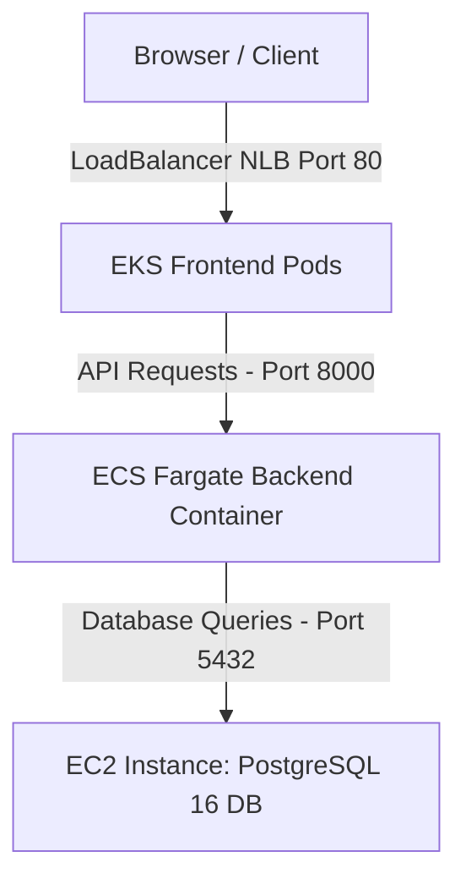

# Architecture 4: EKS (Frontend) + ECS (Backend) + EC2 (DB Layer)

This document provides step-by-step instructions to manually configure and deploy the fourth architecture.



---

## 🗄️ Step 1: Database Setup (EC2 Host)
*Ensure your PostgreSQL EC2 database is running and accessible on port `5432` from ECS Fargate.*
*   Note down your **EC2 DB Private IP** (e.g. `172.31.X.X`).

---

## 🚀 Step 2: Deploy Backend to ECS Fargate (AWS Console)

1.  **Register Backend Task Definition:**
    *   Go to **Amazon ECS** -> **Task definitions** -> **Create new task definition with JSON**.
    *   Create a Task Definition configured for the backend:
        *   **Family:** `office-backend-task`
        *   **CPU:** `256`, **Memory:** `512`
        *   **Container Name:** `office-backend`
        *   **Image:** `542119827880.dkr.ecr.us-east-1.amazonaws.com/backend-app:latest`
        *   **Port Mapping:** `8000/TCP`
        *   **Environment Variables:**
            *   `DATABASE_URL` = `postgresql://postgres:postgres@<YOUR_EC2_DB_PRIVATE_IP>:5432/officedb`
            *   `JWT_SECRET_KEY` = `supersecretkeyofficemanagerpro12345`
            *   `JWT_ALGORITHM` = `HS256`
            *   `ACCESS_TOKEN_EXPIRE_MINUTES` = `60`
            *   `GROQ_API_KEY` = `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`
2.  **Create ECS Backend Service:**
    *   Inside your ECS Cluster `office-records-cluster`, create a **Service**:
        *   Launch Type: **FARGATE**.
        *   Task Definition: `office-backend-task`.
        *   Service Name: `office-backend-service`.
        *   Desired Tasks: `1`.
        *   **Security Group:** Allow Inbound **Port 8000** from anywhere (`0.0.0.0/0`) or restict to EKS Subnet.
        *   **Load Balancer (Optional):** You can set up an Application Load Balancer (ALB) to forward port `80` to container port `8000`, or use the Fargate Public IP directly for testing.
3.  **Get Backend Endpoint:**
    *   Record the Public IP or DNS of the backend (e.g., `http://<ECS_BACKEND_PUBLIC_IP>:8000` or Load Balancer URL).

---

## ☸️ Step 3: Deploy Frontend to EKS Cluster

1.  **Set up Amazon EKS Cluster:**
    *   Using `eksctl` (simplest CLI way):
        ```bash
        eksctl create cluster --name office-eks-cluster --region us-east-1 --fargate
        ```
        *(Or build standard cluster via AWS Console with managed NodeGroups).*
2.  **Build and Push Frontend to ECR:**
    *   On your local machine, build the image pointing to the ECS Backend Endpoint:
        ```bash
        cd frontend
        docker build --build-arg VITE_API_URL=http://<YOUR_ECS_BACKEND_ENDPOINT> -t frontendrepo:latest .
        docker tag frontendrepo:latest 542119827880.dkr.ecr.us-east-1.amazonaws.com/frontendrepo:latest
        docker push 542119827880.dkr.ecr.us-east-1.amazonaws.com/frontendrepo:latest
        ```
3.  **Update Kubernetes Deployment Manifest:**
    *   Open [frontend-k8s.yaml](file:///d:/fullstack/deployments/arch4/frontend-k8s.yaml).
    *   Verify the `image` path matches your ECR URI (line 22):
        ```yaml
        image: 542119827880.dkr.ecr.us-east-1.amazonaws.com/frontendrepo:latest
        ```
4.  **Deploy on EKS:**
    *   Configure `kubectl` context to connect to your EKS cluster:
        ```bash
        aws eks update-kubeconfig --name office-eks-cluster --region us-east-1
        ```
    *   Deploy the resources:
        ```bash
        kubectl apply -f deployments/arch4/frontend-k8s.yaml
        ```
5.  **Get Frontend LoadBalancer Address:**
    *   Run:
        ```bash
        kubectl get services
        ```
    *   Copy the **EXTERNAL-IP** of the service `office-frontend-svc` (e.g. `a7bxxxx.us-east-1.elb.amazonaws.com`).
6.  **Access Site:**
    *   Open the LoadBalancer address in your browser to verify operations.
