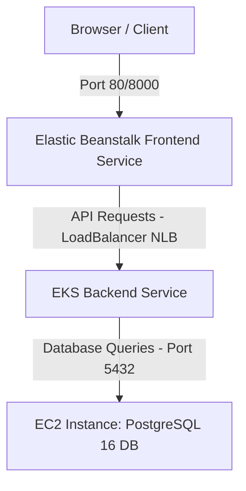

# Architecture 5: Elastic Beanstalk (Frontend) + EKS (Backend) + EC2 (DB Layer)

This document provides step-by-step instructions to manually configure and deploy the fifth architecture.



---

## 🗄️ Step 1: Database Setup (EC2 Host)
*Ensure your PostgreSQL EC2 database is running and accessible on port `5432` from your Amazon EKS cluster.*
*   Note down your **EC2 DB Private IP** (e.g. `172.31.X.X`).

---

## ☸️ Step 2: Deploy Backend to Amazon EKS

1.  **Set up Amazon EKS Cluster:**
    *   Create an EKS cluster `office-eks-cluster` (using `eksctl` or AWS Console).
2.  **Build and Push Backend Image:**
    *   Build the backend image locally and push to ECR:
        ```bash
        cd backend
        docker build -t backend-app:latest .
        docker tag backend-app:latest 542119827880.dkr.ecr.us-east-1.amazonaws.com/backend-app:latest
        docker push 542119827880.dkr.ecr.us-east-1.amazonaws.com/backend-app:latest
        ```
3.  **Configure Kubernetes Backend Manifest:**
    *   Open [backend-k8s.yaml](file:///d:/fullstack/deployments/arch5/backend-k8s.yaml).
    *   Verify the `image` URI matches (line 22).
    *   Update the database environment variable value (line 27) with your EC2 DB Private IP:
        ```yaml
        - name: DATABASE_URL
          value: "postgresql://postgres:postgres@<YOUR_EC2_DB_PRIVATE_IP>:5432/officedb"
        ```
4.  **Deploy Backend on EKS:**
    *   Configure `kubectl` to connect to the cluster:
        ```bash
        aws eks update-kubeconfig --name office-eks-cluster --region us-east-1
        ```
    *   Apply the manifest:
        ```bash
        kubectl apply -f deployments/arch5/backend-k8s.yaml
        ```
5.  **Get EKS Backend LoadBalancer IP/DNS:**
    *   Check service statuses to copy the load balancer address:
        ```bash
        kubectl get services
        ```
        Copy the **EXTERNAL-IP** of `office-backend-svc` (e.g. `a1bxxx.elb.us-east-1.amazonaws.com`). This is your backend api gateway.

---

## 🚀 Step 3: Deploy Frontend to Elastic Beanstalk

1.  **Build Frontend locally:**
    *   Navigate into `frontend` folder.
    *   Build pointing to the EKS Backend LoadBalancer address:
        ```bash
        cd frontend
        npm run build -- --env VITE_API_URL=http://<YOUR_EKS_BACKEND_LOADBALANCER_DNS>:8000
        ```
2.  **Package static build for Elastic Beanstalk:**
    *   Create a simple `Dockerfile` in the frontend `dist/` directory or upload using the Nginx Platform configuration.
    *   Alternatively, you can containerize the frontend from your local workspace:
        *   Tag the frontend image locally:
            ```bash
            docker build --build-arg VITE_API_URL=http://<YOUR_EKS_BACKEND_LOADBALANCER_DNS>:8000 -t frontendrepo:latest .
            ```
        *   Zip the frontend's [Dockerrun.aws.json](file:///d:/fullstack/deployments/arch2/Dockerrun.aws.json) (configured to pull `frontendrepo:latest` on port `80`).
3.  **Launch Elastic Beanstalk Frontend Environment:**
    *   Go to **Elastic Beanstalk** -> **Create application**.
    *   **Application name:** `office-frontend-app`.
    *   **Platform:** Choose **Docker**.
    *   **Application code:** Select **Upload your code** and upload the frontend zip.
    *   Click **Create**.
4.  **Access Site:**
    *   Once the Beanstalk environment becomes healthy, open its environment URL in your browser to verify operations.
